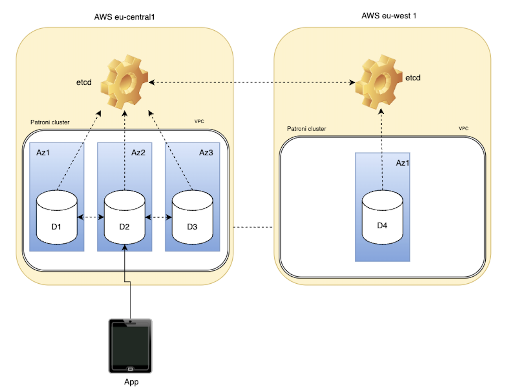

# Revolut-Shubham-App

# 🚀 High-Availability PostgreSQL + FastAPI Hello App

This project implements a production-grade, highly available web app backed by a **self-managed PostgreSQL cluster** with automatic failover, provisioned and configured using **Terraform**, **Ansible**, and **Docker Compose**.

---

##  Features

- ✅ **FastAPI app**:
  - `PUT /hello/<username>`: Save/update birthday
  - `GET /hello/<username>`: Return birthday countdown 
- ✅ **PostgreSQL 14 cluster**:
  - 1 leader + 2 replicas + 1 cross-region replica
  - Managed by **Patroni** + **etcd** for high availability
- ✅ **Terraform** provisions:
  - VPC, subnets, EC2 instances across AZs & regions
- ✅ **Ansible** automates:
  - Installation of PostgreSQL, etcd, and Patroni
- ✅ No managed services (AWS RDS etc.) — 100% self-hosted

---

##  Architecture

Architecture diagram is added in repo - 


##  Project Structure

```bash
.
├── app/                  
│   ├── main.py           
│   ├── models.py         
│   ├── schemas.py       
│   ├── database.py       
│   └── .env              
├── terraform/           
│   ├── main.tf
│   ├── variables.tf
│   ├── outputs.tf
│   └── terraform.tfvars
├── ansible/             
│   ├── inventory/
│   ├── roles/
│   │   ├── patroni/
│   │   └── postgresql/
│   └── site.yml
├── docker-compose.yml    
├── deploy.sh             
└── README.md
```

---

##  Requirements

- AWS CLI with credentials configured
- SSH key pair 
- Terraform ≥ 1.3
- Ansible ≥ 2.12
- Docker + Docker Compose

---

##  Deployment

```bash
# Clone repo
git clone https://github.com/shbhimsa-hub/Revolut-Shubham-App.git
cd Revolut-Shubham-App

# Update vars
vim terraform/terraform.tfvars

# Run full deploy
./deploy.sh
```

At the end, you'll see:
```
✅ Done! App should be available at http://localhost:8000
```

---

##  Usage

### Save a birthday
```bash
curl -X PUT http://localhost:8000/hello/shubham \
  -H "Content-Type: application/json" \
  -d '{"dateOfBirth": "1993-01-09"}'
```

### Get greeting
```bash
curl http://localhost:8000/hello/shubham
```

Example response:
```json
{ "message": "Hello, shubham! Your birthday is in 162 day(s)" }
```

---

##  How Failover Works

- Patroni continuously monitors cluster state using etcd
- When a leader node goes down, a new leader is elected automatically
- Each node shares cluster state via etcd using its private IP

Currently, the FastAPI app uses the leader IP at the time of deployment.

---


##  Notes

- PostgreSQL is configured with `wal_level=replica`, `use_slots=true`
- Replication user is created by Ansible
- Password auth and `pg_hba.conf` allows cross-region replication
- Infrastructure and app can be torn down with:
  ```bash
  cd terraform
  terraform destroy
  ```

---

##  Author

Made with care  by Shubham for Revolut
---
